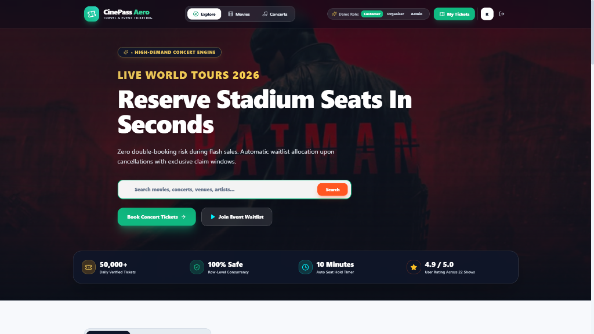
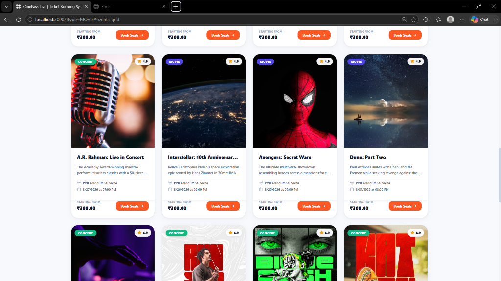
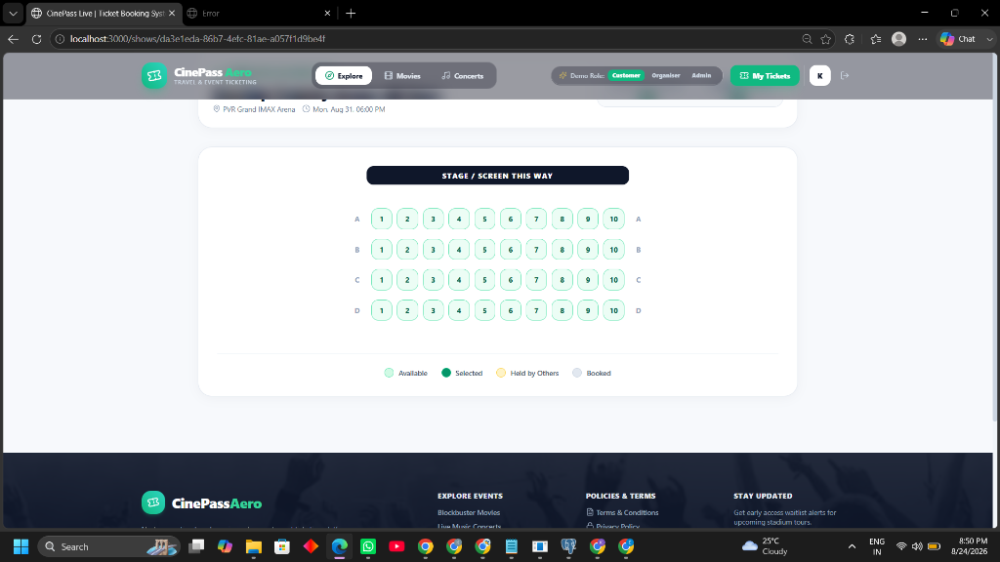
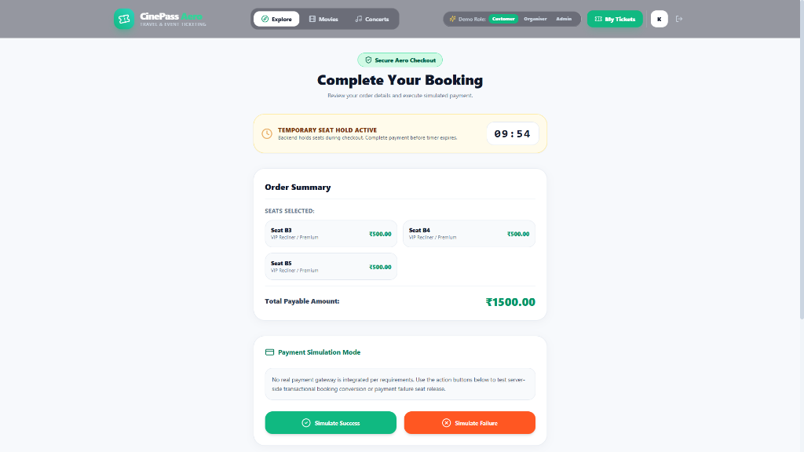
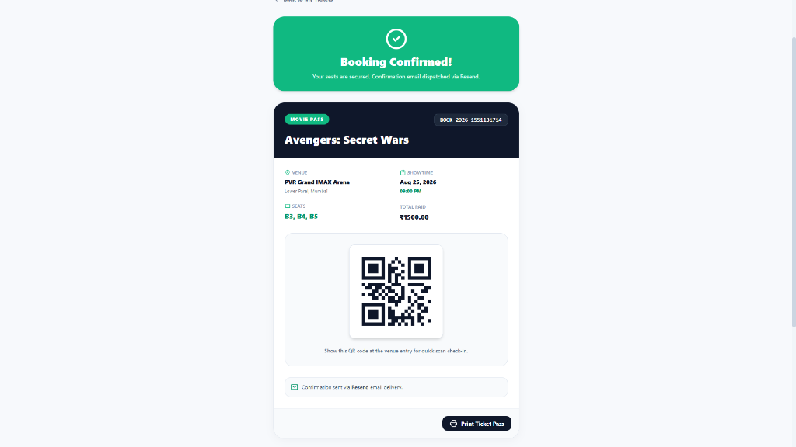

# System Design Document — CinePass Aero Ticket Booking Platform

This document details the core backend system design, database concurrency guarantees, state transition engines, real-time Socket.IO synchronization, and background worker mechanics for the **CinePass Aero Ticket Booking System**.

---

## 1. User Interface & User Experience Architecture

The system features a **Clean Aero Design System** featuring high-contrast hero layouts, visual interactive seating matrices, 10-minute hold timers, and QR ticket passes.

### 🖼️ System Interface Views

| View | Screenshot | Description |
| :--- | :--- | :--- |
| **High-Converting Hero Header** |  | 55% dark tint overlay over full-bleed stage images, soft-gold accents, live search, and platform trust metrics. |
| **22+ Events Grid** |  | Browse and filter movies and stadium concerts with real-time venue tags and pricing badges. |
| **Interactive Seat Map Grid** |  | Visual row seating layout (`AVAILABLE`, `HELD`, `BOOKED`), screen orientation bar, and Socket.IO updates. |
| **Secure Aero Checkout** |  | 10-minute hold countdown timer, seat category breakdown, and server-side payment simulation (`SUCCESS` / `FAILED`). |
| **QR Ticket Pass** |  | Verified single-use QR pass generated via `qrcode` package with Resend email confirmation dispatch. |

---

## 2. Seat Hold & TTL Expiration Mechanism

Seat inventory is managed per show in the `ShowSeat` table with unique constraints on `(showId, seatId)`. A physical venue seat can be booked independently across multiple shows.

### Seat Lifecycle & State Machine

The status of a `ShowSeat` transitions strictly through the following states:

```
                  ┌──────────────┐
                  │  AVAILABLE   │
                  └──────┬───────┘
                         │
             Hold Request│ (SELECT FOR UPDATE)
                         ▼
                  ┌──────────────┐
     ┌───────────►│     HELD     │◄────────────┐
     │            └──────┬───────┘             │
     │                   │                     │
Hold │ TTL       Payment │ Payment    Waitlist │ Claim
Expiry│ Expired   Success │ Failed      Offer  │ Token
     │                   ▼                     │
┌────┴─────────┐  ┌──────────────┐   ┌─────────┴────┐
│  AVAILABLE   │  │    BOOKED    │   │   OFFERED    │
└──────────────┘  └──────────────┘   └──────────────┘
                         │
             Cancellation│
                         ▼
                  ┌──────────────┐
                  │  AVAILABLE   │
                  └──────────────┘
```

### Database-Backed TTL Worker
Instead of volatile in-memory timers (`setTimeout`), holds store `holdExpiresAt = NOW() + SEAT_HOLD_TTL_MINUTES`. A database worker (`releaseExpiredHolds.ts`) periodically scans:

```sql
SELECT id, "showId" FROM "ShowSeat"
WHERE status = 'HELD' AND "holdExpiresAt" < NOW()
FOR UPDATE SKIP LOCKED
```

Expired seats revert to `AVAILABLE`, clearing `holdToken` and `holdExpiresAt`. `SKIP LOCKED` ensures horizontal worker safety without multi-process locking collisions.

---

## 3. Concurrency Protection & Row-Level Locking

To resolve the classic double-booking race condition where two users attempt to hold the exact same seat simultaneously:

### Transactional Row Locking
When a hold request arrives at `POST /api/shows/:showId/holds`, the server executes an explicit PostgreSQL transaction:

```sql
SELECT * FROM "ShowSeat" ss
JOIN "Seat" s ON ss."seatId" = s.id
WHERE ss."showId" = $1 AND ss.id IN ($2, $3)
FOR UPDATE OF ss
```

PostgreSQL acquires an exclusive row-level write lock (`FOR UPDATE`) on the targeted `ShowSeat` rows.

### Execution Path
1. **User A and User B** send simultaneous hold requests for seat `A1`.
2. **User A's transaction** acquires the `FOR UPDATE` lock first. User B's transaction blocks.
3. **User A's transaction** checks `status = AVAILABLE`, sets `status = HELD`, assigns `holdToken`, and commits.
4. **User B's transaction** unblocks, reads the updated state (`status = HELD`), fails validation, rolls back, and returns a `409 Conflict` HTTP response.

At most one user can successfully obtain a hold for any given seat.

---

## 4. FIFO Waitlist & Auto-Allocation Engine

When a seat category is sold out, customers can join a category waitlist (`WaitlistEntry`). Queue ordering is strictly FIFO based on `createdAt` timestamp.

### Automatic Allocation on Cancellation
When a confirmed booking is cancelled (`POST /api/bookings/:id/cancel`):
1. The booking status transitions to `CANCELLED` and `ShowSeat` status is reset to `AVAILABLE` within a transaction.
2. The system queries the earliest active waitlist entry for the affected `(showId, categoryId)`:
   ```sql
   SELECT * FROM "WaitlistEntry"
   WHERE "showId" = $1 AND "categoryId" = $2 AND status = 'WAITING'
   ORDER BY "createdAt" ASC LIMIT 1
   ```
3. If an entry is found, the system generates a secure random token, stores its SHA-256 hash in `WaitlistOffer`, sets `expiresAt = NOW() + WAITLIST_OFFER_TTL_MINUTES`, and transitions the waitlist entry to `OFFERED`.

---

## 5. Time-Limited Waitlist Offers & Expiry

Waitlist offers expire after a configurable duration (default 10 minutes).

### Token Security & Verification
Raw tokens are sent exclusively in customer email notifications (`/claim-seat?token=<rawToken>`). The database stores only `tokenHash = SHA256(rawToken)`. When claimed, the server computes the hash and verifies `status = PENDING` and `expiresAt > NOW()`.

### Expired Offer Re-Allocation
A background job (`processExpiredWaitlistOffers.ts`) periodically scans:

```sql
SELECT * FROM "WaitlistOffer"
WHERE status = 'PENDING' AND "expiresAt" < NOW()
FOR UPDATE SKIP LOCKED
```

Expired offers transition to `EXPIRED`. The seat is released to `AVAILABLE` and immediately passed to the next customer in the FIFO waitlist queue.

---

## 6. Real-Time Updates & Email/QR Architecture

### Real-Time Socket.IO Synchronization
Clients viewing a show join the Socket.IO room `show:<showId>`. State changes trigger room broadcasts (`seat:held`, `seat:released`, `seat:booked`, `seat:offered`). Broadcast payloads contain only non-sensitive data (`showId`, `seatId`, `status`), preventing exposure of hold tokens or customer identity.

### QR Code & Email Dispatch
Upon successful payment simulation:
1. The server generates a unique reference (`BOOK-2026-XXXXXX`) and a PNG Data URI QR code containing only the reference.
2. The database transaction commits the booking.
3. An asynchronous non-blocking job invokes the Resend email service to send ticket confirmation. If email delivery fails, the booking remains `CONFIRMED` and errors are logged.
